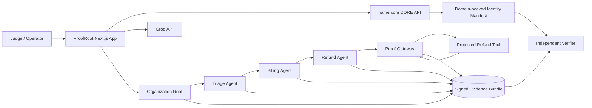

# ProofRoot

> **The flight recorder for autonomous AI agents.**

ProofRoot gives every AI agent a domain-backed identity and turns every delegation and consequential tool call into a signed, independently verifiable chain of custody.

## Why ProofRoot

When a multi-agent system issues a refund, changes infrastructure, writes to a database, or takes another consequential action, ordinary logs can tell you what the application says happened. They often cannot independently prove:

- which agent runtime requested a step;
- who delegated authority to it;
- what limits applied;
- whether the request stayed inside those limits;
- what the protected tool boundary actually allowed and observed;
- whether stored evidence was altered afterward.

ProofRoot separates **agent intent** from **gateway-observed execution**:

> The agent signs what it requested. The credential-holding Proof Gateway independently signs what it allowed, blocked, sent to the tool, and observed in response.

## Golden demo

The judging workflow is intentionally narrow and reproducible:

> Resolve support case `#194`. The customer reports a duplicate charge. Refund a confirmed duplicate charge only if the amount is no more than `$100`.

The normal run is:

1. Organization signs a Root Mandate.
2. Triage Agent routes the case to Billing.
3. Billing confirms the controlled-fixture `$85` duplicate charge.
4. Billing delegates refund authority capped at `$100`.
5. Refund Agent signs an `$85` Action Request.
6. Proof Gateway verifies identity evidence, signatures, lineage, expiry, constraints, parameters and replay state.
7. The Gateway invokes the protected deterministic refund tool only after validation succeeds.
8. The tool returns `sim-refund-194-usd-8500`.
9. The Gateway signs execution evidence and seals the run.
10. A separate verifier recomputes the evidence checks.

## Two mandatory attacks

### Authority violation

Refund Agent requests `$850` under its signed `$100` cap.

Expected result:

**BLOCKED BEFORE EXECUTION**

The protected tool is not called, no transaction is created, and the blocked decision itself is signed evidence.

### Evidence tampering

A completed `$85` Action Request is modified in storage to display `$850` without re-signing it.

Expected result:

**VERIFICATION FAILED**

The verifier identifies the altered receipt and marks downstream dependent evidence as affected.

## Architecture



More detail: [`docs/ARCHITECTURE.md`](docs/ARCHITECTURE.md).

## name.com is structurally necessary

ProofRoot uses name.com as the control plane for the organization-controlled identity namespace, not just as a branded URL.

Implemented name.com CORE v1 surfaces include:

- authenticated provider check;
- domain search;
- exact availability checks;
- sandbox provisioning;
- managed-domain listing;
- DNS record create/list/update/delete;
- organization ProofRoot TXT publication;
- manifest CNAME publication;
- per-agent locator records;
- provider-state reconciliation.

### Sandbox truth boundary

The official name.com sandbox stores and returns DNS records through the API, but those records are **not publicly resolvable DNS**. ProofRoot therefore labels sandbox verification as:

**Name.com Sandbox / Provider-Backed Verification**

Production mode uses public TXT lookup only after a real production domain has been configured. ProofRoot does not display or claim DNSSEC unless it is genuinely configured and validated.

## Agent and gateway identities

ProofRoot uses Ed25519 signing identities for:

- Organization root;
- Triage Agent;
- Billing Agent;
- Refund Agent;
- Proof Gateway.

Development runs can use ephemeral identities and are labeled accordingly. A deployed domain-backed run must use persistent signing material whose public keys exactly match the signed public manifest.

Private keys are never committed. Deployment provisioning writes local material only to ignored `.proofroot/` files and transfers private key values to the deployment secret environment.

## Signed evidence model

ProofRoot currently implements:

- Root Mandate;
- Delegation Receipt;
- Action Request Receipt;
- Gateway Decision Receipt;
- Execution Receipt;
- Run Seal;
- canonical `proofroot.bundle.v1` export.

Each signed receipt commits to its material content with canonical JSON + SHA-256 and includes signer/key identity, timestamps, nonce, run ID, and causal parent digests.

Sensitive evidence can be represented through redacted values and digests. Raw model chain-of-thought fields are rejected from the evidence contract.

## Independent verification

The verifier does not read a stored green badge. It recomputes six separate results:

1. identity resolution;
2. signature validity;
3. delegation validity;
4. constraint validity;
5. gateway evidence;
6. bundle integrity.

A valid signature is not treated as proof that the signer is trustworthy, and identity resolution is not collapsed into authorization.

## What ProofRoot can demonstrate

- signed evidence has not changed since signing;
- an action request matches the public key of the claimed agent identity;
- bounded delegation is causally linked back to the root mandate;
- a child delegation does not broaden parent authority;
- an action stayed inside or exceeded its signed constraints;
- the Proof Gateway allowed or blocked the request;
- the Proof Gateway sent a particular protected-tool request and observed a particular response;
- a sealed evidence bundle is internally consistent;
- tampering and wrong-key impersonation fail verification.

## What ProofRoot does not claim

ProofRoot does **not** claim:

- legal liability determination;
- that a valid domain owner or cryptographic identity is trustworthy;
- access to private model reasoning;
- that cryptography proves every external real-world consequence;
- DNSSEC guarantees when DNSSEC is not configured;
- globally immutable or complete history if protected tools can be called outside the Gateway;
- replacement of OAuth, workload identity, MCP authorization, or enterprise IAM.

## Product surfaces

- `/domain` — name.com lifecycle and environment truth boundary
- `/organization` — organization identity root and manifest state
- `/agents` — distinct agent/gateway identities
- `/run` — executable signed golden workflow
- `/chain` — causal graph and raw receipt explorer
- `/verify` — independent bundle verification
- `/attacks` — authority and evidence-tampering attacks

## Tech stack

- Next.js 16
- React 19
- Node.js 22+
- Node built-in Ed25519/SHA-256 cryptography
- name.com CORE v1 API
- Groq OpenAI-compatible API for the deployed model-driven Triage decision
- deterministic protected refund simulator for the P0 consequential action
- GitHub Actions
- Vercel deployment target

## Local setup

Requirements: Node.js 22 or newer.

```bash
npm install
npm test
npm run build
npm run dev
```

Without secrets, the signed workflow, gateway, verifier and attacks work with explicitly labeled development identity/model fallbacks. name.com calls fail closed as unconfigured.

## Environment variables

Copy `.env.example` to a local ignored `.env.local` when needed.

Important deployment variables:

```text
NAMECOM_ENV
NAMECOM_USERNAME
NAMECOM_TOKEN
PROOFROOT_DOMAIN
PROOFROOT_PUBLIC_MANIFEST_JSON
PROOFROOT_SIGNING_KEYS_JSON
PROOFROOT_MANIFEST_TARGET_HOST
GROQ_API_KEY
GROQ_MODEL
```

`NAMECOM_TOKEN`, `GROQ_API_KEY`, and `PROOFROOT_SIGNING_KEYS_JSON` are secrets and must never be committed.

## Provider checks

```bash
npm run check:namecom
npm run check:groq
```

These commands perform real provider checks when their environment variables are present. Automated unit tests around provider clients use injected test doubles and are never presented as live connectivity evidence.

## Persistent identity provisioning

After selecting the deployment domain:

```bash
PROOFROOT_DOMAIN=your-domain.example npm run provision:identity
```

This creates ignored local files:

```text
.proofroot/public-manifest.json
.proofroot/signing-keys.json
```

The public manifest may be served publicly. `signing-keys.json` must remain private and be transferred directly into the deployment secret environment.

Once the deployment manifest hostname is known and name.com secrets are present:

```bash
npm run publish:identity
```

The publication script creates or updates the desired name.com identity records and reconciles them against the provider response.

See [`docs/DEPLOYMENT.md`](docs/DEPLOYMENT.md) before running this against any live environment.

## Validation

```bash
npm test
npm run build
```

The test suite covers the evidence contract, key isolation, tampering, delegation lineage, Gateway enforcement, amount violations, replay, protected-tool failures, Groq contract behavior, name.com API contract behavior, identity publication/resolution, mandatory attacks, persistent-key continuity, and secret hygiene.

Live provider/deployment validation is tracked separately in [`docs/IMPLEMENTATION_STATUS.md`](docs/IMPLEMENTATION_STATUS.md).

## Project documents

- [`docs/VISION.md`](docs/VISION.md) — product north star
- [`docs/IMPLEMENTATION.md`](docs/IMPLEMENTATION.md) — implementation plan
- [`docs/IMPLEMENTATION_STATUS.md`](docs/IMPLEMENTATION_STATUS.md) — phase-by-phase actual state
- [`docs/STATUS.md`](docs/STATUS.md) — current execution checkpoint
- [`docs/ARCHITECTURE.md`](docs/ARCHITECTURE.md) — system architecture
- [`docs/DEPLOYMENT.md`](docs/DEPLOYMENT.md) — deployment and secret handoff
- [`docs/DEMO.md`](docs/DEMO.md) — demo recording path
- [`docs/DEVPOST.md`](docs/DEVPOST.md) — submission copy

## License / external services

ProofRoot is a hackathon prototype. It uses Next.js/React and integrates with name.com and Groq under their respective terms. The product framing is standards-aware but does not claim to have invented agent identity, signed action evidence, or legal accountability.
