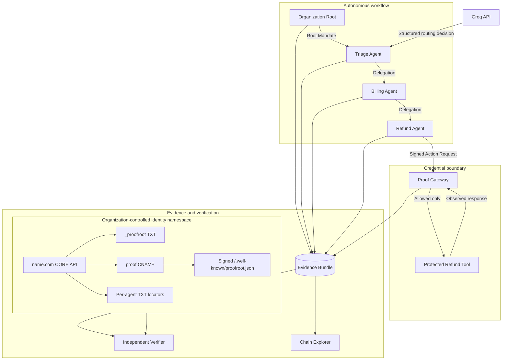
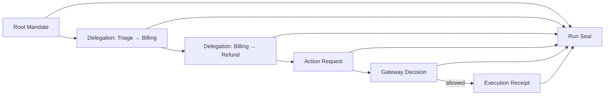
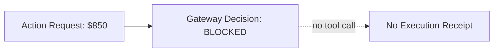

# ProofRoot Architecture

ProofRoot is split around one security boundary:

> Agents may request consequential actions. Only the Proof Gateway holds the capability to execute them.

The system then preserves two kinds of evidence:

- **agent evidence** — signed mandate, delegation and action-request records;
- **boundary evidence** — signed Gateway decision and execution records describing what the protected boundary allowed and observed.

## System view



## Trust boundaries

### 1. Domain identity boundary

The organization publishes identity material under a name.com-managed namespace.

ProofRoot supports two truthful modes:

- **Name.com Sandbox / Provider-Backed Verification** — the verifier reads the `_proofroot` record from the name.com API. The record is not claimed to resolve publicly.
- **Production Public DNS** — the verifier resolves `_proofroot.<domain>` through public DNS and fetches the signed manifest. Plain DNS discovery is not called DNSSEC unless DNSSEC is separately configured and validated.

The domain record is intentionally compact. The signed HTTPS manifest holds richer public identity state.

### 2. Agent signing boundary

Organization, Triage, Billing, Refund and the Proof Gateway each have a distinct Ed25519 key.

For deployment, public records live in the signed manifest while PKCS#8 private material lives only in deployment secrets.

The runtime refuses to use a private key if it does not derive the public key/fingerprint declared by the manifest.

### 3. Proof Gateway boundary

The Proof Gateway verifies before executing:

1. Action Request signature.
2. Requester key validity at event time.
3. Root Mandate signature/validity.
4. Every delegation signature.
5. Causal parent-digest links.
6. Delegator/delegate lineage.
7. Delegation expiry.
8. Authority attenuation.
9. Allowed action.
10. Refund amount cap.
11. Actual tool-parameter digest against signed request evidence.
12. One-time nonce replay state.

Only an allowed request reaches the protected tool.

### 4. Independent verification boundary

The verifier recomputes six independent dimensions:

- identity resolution;
- signature validity;
- delegation validity;
- constraint validity;
- Gateway evidence;
- bundle integrity.

It never converts these into one unexplained trust score.

## Evidence graph



For a blocked action the Execution Receipt does not exist:



## Evidence objects

### Root Mandate

Commits to initiating principal, first agent, task, constraints, validity window and run ID.

### Delegation Receipt

Commits to parent evidence, delegator, recipient, purpose, permitted actions, constraints, expiry and nonce.

### Action Request Receipt

Commits to the exact delegated evidence, agent, protected tool/action, privacy-preserving parameter evidence and expected effect.

### Gateway Decision Receipt

Commits to the evaluated Action Request, deterministic check results, decision and reason codes.

### Execution Receipt

Exists only after an allowed action reaches the protected tool. Commits to the Gateway Decision, tool request/response digests, observed effect state and transaction ID when present.

### Run Seal

Commits to the exact receipt set in the run bundle.

## Canonicalization and signatures

- Canonical JSON provides stable signed bytes.
- SHA-256 produces stable content digests.
- Ed25519 signs evidence and identity manifests.
- Database row IDs are not part of the integrity model.
- Material receipt changes invalidate both content digest and signature.

## Sensitive data model

ProofRoot does not need raw customer data or model chain-of-thought to demonstrate accountability.

Sensitive values may be represented as:

```json
{
  "redacted": true,
  "digest": "sha256:..."
}
```

The evidence contract rejects raw private-reasoning fields.

## Golden run

```text
Organization
  ↓ signed Root Mandate
Triage Agent
  ↓ model/fallback route + signed bounded delegation
Billing Agent
  ↓ controlled duplicate finding + signed $100 delegation
Refund Agent
  ↓ signed $85 Action Request
Proof Gateway
  ↓ deterministic verification
Protected Refund Tool
  ↓ sim-refund-194-usd-8500
Proof Gateway
  ↓ signed Execution Receipt + Run Seal
Independent Verifier
```

## Deployment identity continuity

A deployed run must not generate an unrelated key pair and then claim the domain manifest identifies it.

ProofRoot therefore has two explicit modes:

### Development

Ephemeral per-run keys are allowed. Evidence remains cryptographically verifiable against the keys included in the bundle, but domain-backed identity is marked unavailable/unverifiable.

### Deployment

`PROOFROOT_PUBLIC_MANIFEST_JSON` contains the signed public manifest and `PROOFROOT_SIGNING_KEYS_JSON` contains the matching private keys as a deployment secret. Receipt signers are reconstructed from these secrets and checked against the manifest before use.

This is what lets independent name.com-backed identity resolution validate the same keys that actually signed the run.

## External dependencies

### name.com

Used for domain discovery/provisioning and DNS identity publication. It is structurally part of the verifier's identity-discovery path.

### Groq

Used for a materially model-driven Triage routing decision in the deployed demo. The workflow has an explicitly labeled deterministic fallback for reproducibility when no model secret exists.

### Vercel

Deployment target for the Next.js product and public identity manifest endpoint.

### Protected refund simulator

The P0 consequential tool is deterministic and explicitly labeled simulated. It returns a stable transaction identifier and can only be called through the Proof Gateway in the golden workflow.

## Deliberate non-goals

The architecture does not claim:

- legal accountability;
- globally immutable history;
- DNSSEC without a real signed DNSSEC chain;
- that identity means trustworthiness;
- that signatures expose model reasoning;
- protection for actions that bypass the protected Gateway;
- replacement of enterprise IAM/OAuth/MCP authorization.
